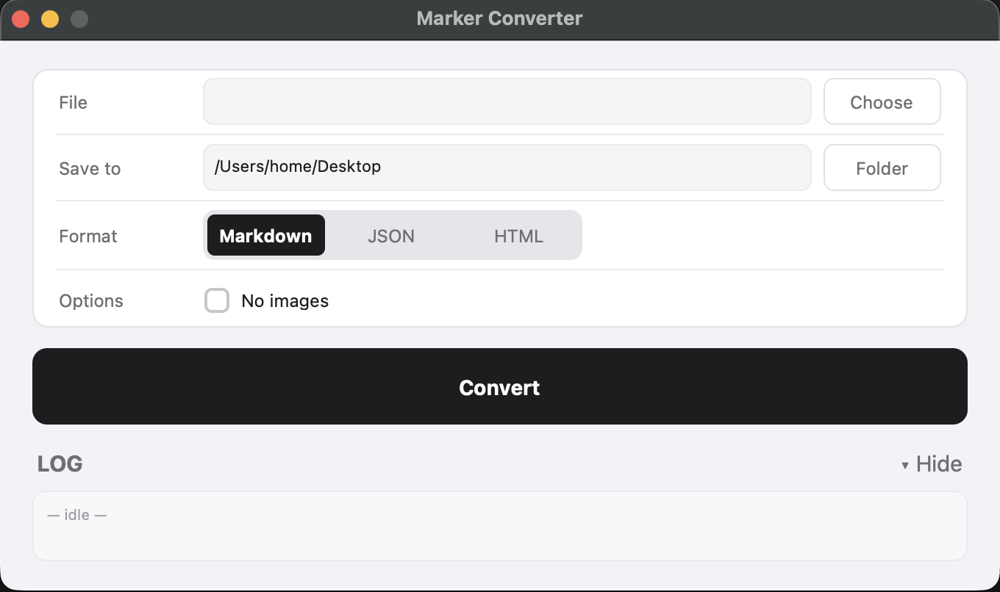

# Marker Converter — PDF to Markdown converter for macOS

**English** | [Русский](README.ru.md)

Marker Converter is a free, open-source macOS app that converts PDF, Word (DOCX),
PowerPoint (PPTX), Excel (XLSX), EPUB and HTML documents into clean **Markdown**,
**JSON** or **HTML** — entirely on your Mac, with built-in OCR, no cloud and no
subscription. It is a native graphical interface (GUI) for the
[marker-pdf](https://github.com/datalab-to/marker) conversion engine: pick a file,
pick a folder, press Convert.



## Key features

- **Converts PDF to Markdown** — including scanned PDFs, thanks to built-in OCR
  (the [surya](https://github.com/datalab-to/surya) models used by marker)
- **Also converts DOCX, PPTX, XLSX, EPUB and HTML** to Markdown, JSON or HTML
- **Extracts images and tables** from documents and saves them next to the output
- **100% local and offline** after the one-time setup — documents never leave your Mac,
  so it is safe for private and confidential files
- **No terminal, no Python knowledge required** — a regular Mac app with a single window
- **Free and open source** (MIT-licensed GUI code)

## Common use cases

- Preparing documents for **LLMs, RAG pipelines and AI assistants** — Markdown is the
  preferred input format for ChatGPT, Claude and other models
- Importing PDFs and Word documents into **Obsidian, Notion or other Markdown
  note-taking apps**
- Turning scanned books and papers into searchable, editable text (OCR)
- Bulk archiving of office documents in a plain-text, future-proof format

## Requirements

- Mac with **Apple Silicon** (M1, M2, M3, M4 or later) — Intel Macs are not supported
- macOS 12.0 or newer
- ~10 GB of free disk space and an internet connection for the first launch

## Installation

1. Download `MarkerConverter.dmg` from the
   [latest release](https://github.com/nobexmusic/marker-converter-gui/releases/latest),
   mount it and drag the app into `Applications`.
2. First launch: right-click → "Open" (the app is unsigned).
3. Wait 5–15 minutes — the installer automatically downloads Python, packages and
   the ML models (~5 GB). Progress is logged to `~/Library/Logs/MarkerConverter-setup.log`.

After that the app starts instantly and works fully offline. Each macOS user gets
their own installation (`~/Library/Application Support/MarkerConverter`).

## FAQ

**Is Marker Converter free?**
Yes. The app is free and open source (MIT). It wraps the open-source marker-pdf
engine; see [License](#license) for the engine's own terms.

**Does it work offline? Is my data uploaded anywhere?**
After the one-time model download, conversion runs entirely on your Mac. No file,
page or text is ever sent to a server.

**Can it convert scanned PDFs?**
Yes. OCR is built in: marker detects page layout, recognizes text (including
scanned pages), tables and equations, and produces structured Markdown.

**Why does it need ~10 GB and a long first launch?**
The first launch downloads a private Python runtime and ~3.3 GB of machine-learning
models for layout detection and OCR. This happens once.

**Does it run on Intel Macs?**
No, Apple Silicon (M1 or later) only.

**Where is my converted file?**
In the output folder you chose: `<folder>/<name>/<name>.md` (or `.json` / `.html`),
with extracted images next to it. The "Open ↗" button reveals it in Finder.

## Building the DMG

```bash
./packaging/build.sh
# → ~/Desktop/MarkerConverter.dmg
```

The script builds the .app in a temp folder, downloads a pinned uv version
(with a sha256 check), styles the DMG window and sets the app icon on the .dmg file.

## Running from sources (for development)

```bash
"$HOME/Library/Application Support/MarkerConverter/env/bin/python" marker-app.py
```

Requires the app's installed env (created by `packaging/setup.sh` or by the
first launch of the installed app).

## Repository layout

```
marker-converter-gui/
├── marker-app.py        # the whole app: UI (customtkinter) + marker_single runner
├── packaging/
│   ├── build.sh         # builds the .app + the styled DMG
│   ├── launcher.sh      # bundle entrypoint: first run → setup.sh, then → python
│   ├── setup.sh         # installs Python 3.12 + marker-pdf + preloads the models
│   ├── Info.plist
│   └── dmg-background.tiff  # DMG window background (1x+2x)
└── assets/
    ├── icon.svg              # icon source, 1024×1024
    ├── AppIcon.icns / .png   # app icon (all sizes + Retina)
    └── StatusBarIconTemplate.svg / .png / @2x.png  # menu bar icon (Template)
```

## How it works

- On first launch `launcher.sh` runs `setup.sh`: installs Python 3.12 via the
  bundled uv, the `marker-pdf[full]==1.10.2`, `customtkinter`, `pyobjc` packages,
  and downloads all ML models — conversion is ready right after the installation.
- The app runs `marker_single <file> --output_dir <folder> --output_format <fmt>`
  (plus `--disable_image_extraction` when the "No images" checkbox is on) and waits
  for the process to finish; its output is streamed to the log with highlighting.
- Result: `<folder>/<name>/<name>.{md,json,html}` with the extracted images next to it.

## License

The code in this repository is licensed under the [MIT License](LICENSE).

Note: this app does not bundle marker itself — the installer downloads
[marker-pdf](https://github.com/datalab-to/marker) at first launch. Marker's code
is GPL-3.0 and its model weights use a modified AI Pubs Open Rail-M license
(free for research, personal use and small startups; see the marker repository
for commercial terms). Your use of marker through this app is subject to those terms.
